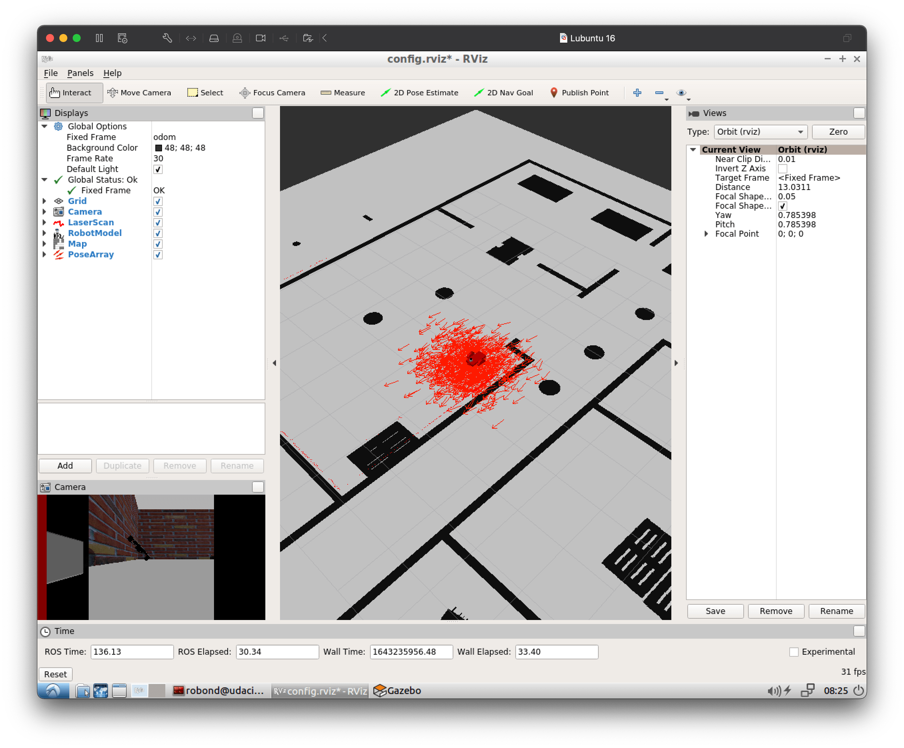
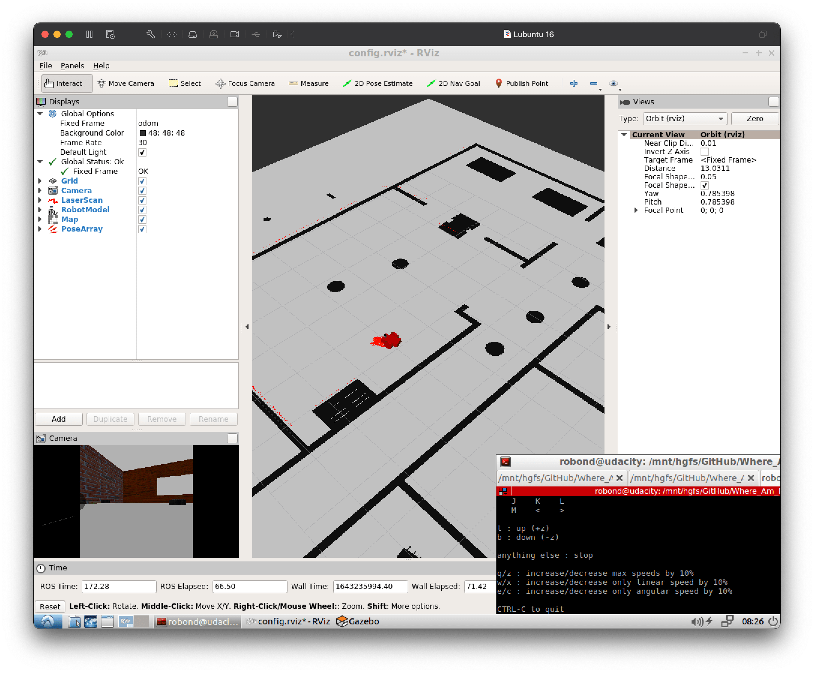

# Where_Am_I
[](https://opensource.org/licenses/MIT) [](https://svgshare.com/i/Zhy.svg) [](https://atom.io) [](https://www.codefactor.io/repository/github/michellemouse/where_am_i) [](https://github.com/MichelleMouse/Where_Am_I/issues) [](https://github.com/MichelleMouse/Where_Am_I/issues)   

Localisation project for Udacity's [Robotics Software Engineer Nanodegree](https://www.udacity.com/course/robotics-software-engineer--nd209) program where I use EMCL algortihm to localise my custom robot inside the Gazebo World!

<p align="center"> </p>

## Environment
👉 Ubuntu 16.04 LTS  
👉 [ROS Kinetic Kame](http://wiki.ros.org/kinetic)  
👉 Gazebo 7.8.1  
👉 rviz 1.12.17  
👉 C++ 11  
👉 ROS [AMCL](http://wiki.ros.org/amcl), [Navigation](http://wiki.ros.org/navigation), [Move Base](http://wiki.ros.org/move_base) and [Map Server](http://wiki.ros.org/map_server) Kinetic packages.

## Compiling and Running
### Dependencies
You might need to install the following packages:  
```
$ sudo apt-get install ros-kinetic-navigation
$ sudo apt-get install ros-kinetic-map-server
$ sudo apt-get install ros-kinetic-move-base
$ sudo apt-get install ros-kinetic-amcl
$ sudo apt-get install libignition-math2-dev protobuf-compiler
```  

### Compiling
First, make sure you have sourced your ROS distro into the terminal environment
```
source /opt/ros/kinetic/setup.bash
```
Then, create a catkin workspace (skip this step if you already have one)
```
mkdir -p /home/workspace/catkin_ws/src/
cd /home/workspace/catkin_ws/src
catkin_init_workspace
```
Clone this repository inside the `catkin_ws` folder
```
git clone https://github.com/MichelleMouse/Where_Am_I.git .
```
Build the package and source the `.bash` setup into the environment
```
cd ..
catkin_make
source devel/setup.bash
```

You might need to clone the `pgm_map_creator` repository:
```
cd /home/workspace/catkin_ws/src/
git clone https://github.com/udacity/pgm_map_creator.git
cd ..
catkin_make
```

If you have any issues at compiling the project have a look at the tab [Issues](https://github.com/MichelleMouse/Where_Am_I/issues) for possible solutions.

### Running
Launch the simulation environment and RViz
```
roslaunch my_robot world.launch
```
Then, open a second terminal, source ROS and `devel/setup.bash` and run the amcl launch file
```
cd /home/workspace/catkin_ws/
source devel/setup.bash
roslaunch my_robot amcl.launch
```
To give the robot a goal position, you can take the following approaches:  
1. Send a `2D Nav Goal` using rviz  
2. Run the node `teleop_twist_keyboard` in another terminal and use the keyboard to control the robot   
